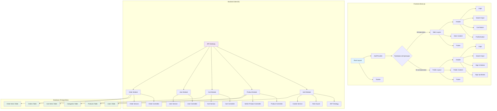
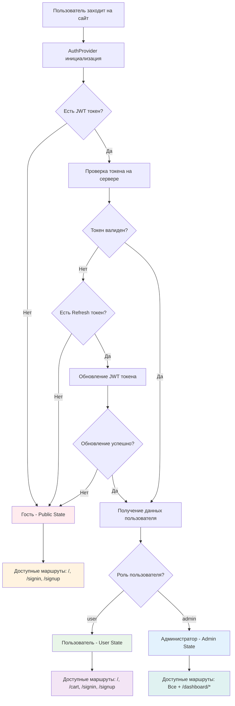
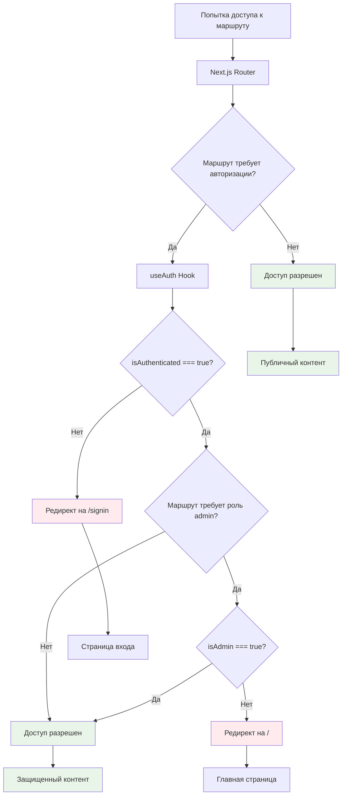
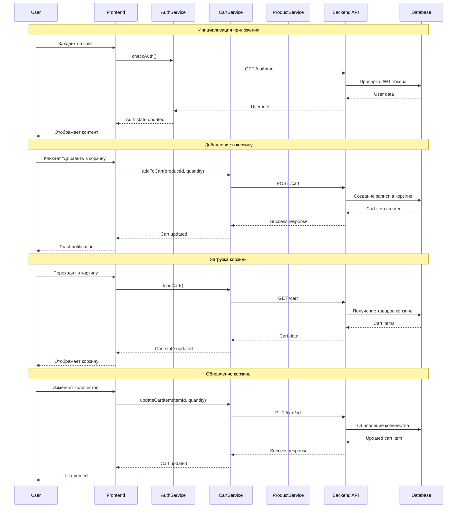
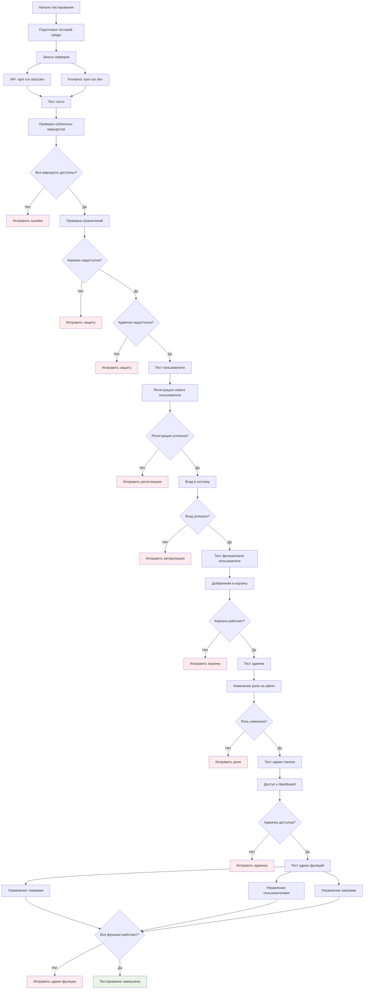
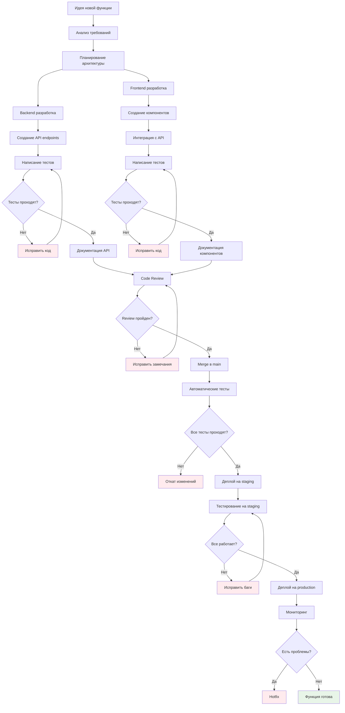

# 🎨 Профессиональные графические диаграммы

## 🏗️ Архитектура приложения



## 🔐 Система авторизации и ролей



## 🛡️ Защита маршрутов - Детальный процесс



## 🛒 Поток корзины - Полный цикл

```mermaid
flowchart TD
    A[Пользователь на главной странице] --> B{Авторизован?}
    
    B -->|Нет| C[Показать кнопку "Войти"]
    B -->|Да| D[Показать кнопку "Добавить в корзину"]
    
    D --> E[Клик "Добавить в корзину"]
    E --> F[AddToCartButton Component]
    F --> G[useCart Hook]
    G --> H[cartService.addToCart API]
    
    H --> I{API запрос успешен?}
    I -->|Нет| J[Показать ошибку toast]
    I -->|Да| K[Показать успех toast]
    
    K --> L[Обновить состояние корзины]
    L --> M[Обновить счетчик в CartButton]
    M --> N[Переход в корзину /cart]
    
    N --> O[CartPage Component]
    O --> P[useCart Hook - loadCart]
    P --> Q[cartService.getCart API]
    
    Q --> R{Корзина загружена?}
    R -->|Нет| S[Показать ошибку]
    R -->|Да| T[Отобразить товары в корзине]
    
    T --> U[Управление количеством]
    U --> V[updateCartItem API]
    V --> W[Обновить корзину]
    
    T --> X[Удаление товара]
    X --> Y[removeFromCart API]
    Y --> Z[Обновить корзину]
    
    T --> AA[Очистка корзины]
    AA --> BB[clearCart API]
    BB --> CC[Корзина пуста]
    
    T --> DD[Оформление заказа]
    DD --> EE[Переход к checkout]
    
    style C fill:#ffebee
    style J fill:#ffebee
    style S fill:#ffebee
    style K fill:#e8f5e8
    style T fill:#e8f5e8
    style W fill:#e8f5e8
    style Z fill:#e8f5e8
    style CC fill:#e8f5e8
    style EE fill:#e8f5e8
```

## 📱 Навигация и меню

```mermaid
graph TB
    subgraph "Header Navigation"
        A[Header Component] --> B{isAuthenticated?}
        
        B -->|Нет| C[Public Header]
        B -->|Да| D[Authenticated Header]
        
        C --> E[Logo]
        C --> F[Search Input]
        C --> G[Sign In Button]
        C --> H[Sign Up Button]
        
        D --> I[Logo]
        D --> J[Search Input]
        D --> K[Cart Button]
        D --> L[Profile Button]
        
        L --> M{isAdmin?}
        M -->|Нет| N[Профиль пользователя]
        M -->|Да| O[Админ панель]
        
        N --> P[/profile]
        O --> Q[/dashboard]
    end
    
    subgraph "Admin Sidebar"
        Q --> R[AppSidebar]
        R --> S[AdminNav]
        
        S --> T[Обзор /dashboard]
        S --> U[Пользователи /dashboard/users]
        S --> V[Товары /dashboard/products]
        S --> W[Заказы /dashboard/orders]
        S --> X[Доставки /dashboard/shipping]
        S --> Y[Платежи /dashboard/payments]
        S --> Z[Настройки /dashboard/settings]
    end
    
    subgraph "Mobile Menu"
        AA[Burger Menu] --> BB{isAuthenticated?}
        
        BB -->|Нет| CC[Public Mobile Menu]
        BB -->|Да| DD[Authenticated Mobile Menu]
        
        CC --> EE[Главная]
        CC --> FF[Войти]
        CC --> GG[Регистрация]
        
        DD --> HH[Главная]
        DD --> II[Корзина]
        DD --> JJ[Профиль]
        DD --> KK[Выйти]
        
        JJ --> LL{isAdmin?}
        LL -->|Да| MM[Админ панель]
    end
    
    style C fill:#ffebee
    style D fill:#e8f5e8
    style R fill:#e3f2fd
    style S fill:#e3f2fd
    style CC fill:#ffebee
    style DD fill:#e8f5e8
```

## 🔄 API взаимодействие



## 🎯 Тестирование - Полный цикл



## 🚀 Поток разработки и деплоя



## 📊 Мониторинг и аналитика

```mermaid
graph TB
    subgraph "Метрики производительности"
        A[Frontend Metrics] --> A1[Page Load Time]
        A --> A2[Time to Interactive]
        A --> A3[Bundle Size]
        A --> A4[Core Web Vitals]
        
        B[Backend Metrics] --> B1[Response Time]
        B --> B2[Throughput]
        B --> B3[Error Rate]
        B --> B4[Database Queries]
        
        C[Business Metrics] --> C1[User Registrations]
        C --> C2[Cart Conversions]
        C --> C3[Order Completions]
        C --> C4[Revenue]
    end
    
    subgraph "Система мониторинга"
        D[Application Monitoring] --> D1[Error Tracking]
        D --> D2[Performance Monitoring]
        D --> D3[User Behavior]
        D --> D4[Security Events]
        
        E[Infrastructure Monitoring] --> E1[Server Health]
        E --> E2[Database Performance]
        E --> E3[Network Latency]
        E --> E4[Resource Usage]
    end
    
    subgraph "Алерты и уведомления"
        F[Alert System] --> F1[High Error Rate]
        F --> F2[Slow Response Time]
        F --> F3[Security Breach]
        F --> F4[System Down]
        
        G[Notification Channels] --> G1[Email]
        G --> G2[Slack]
        G --> G3[SMS]
        G --> G4[Dashboard]
    end
    
    A --> H[Data Collection]
    B --> H
    C --> H
    D --> H
    E --> H
    
    H --> I[Analytics Dashboard]
    I --> J[Reports]
    I --> K[Insights]
    I --> L[Recommendations]
    
    F --> M[Automated Actions]
    G --> M
    
    style A1 fill:#e8f5e8
    style B1 fill:#e8f5e8
    style C1 fill:#e8f5e8
    style D1 fill:#e3f2fd
    style E1 fill:#e3f2fd
    style F1 fill:#fff3e0
    style G1 fill:#fff3e0
``` 

